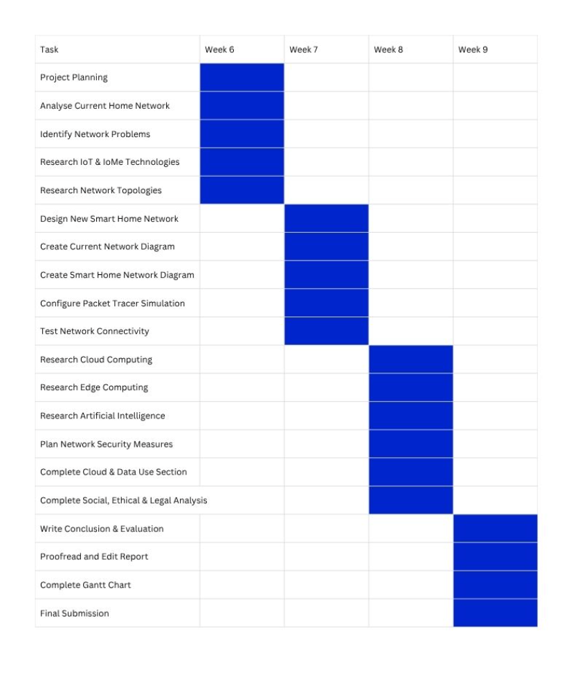
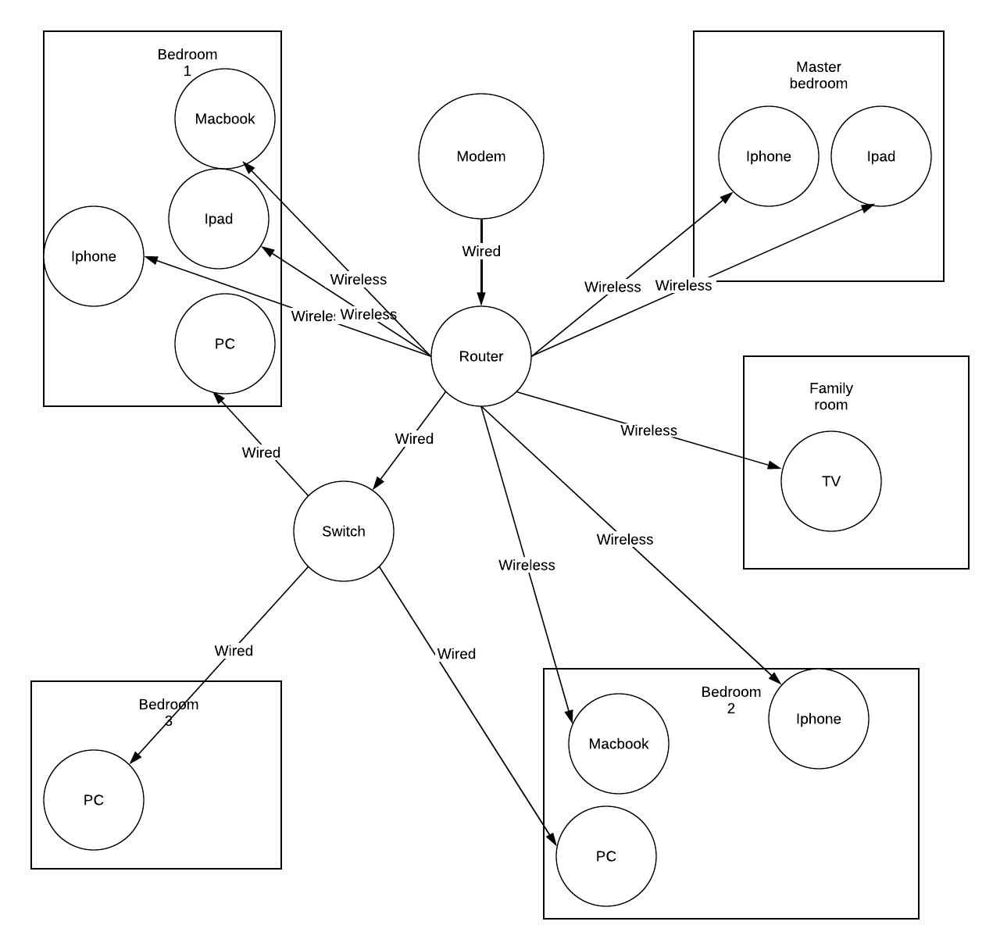
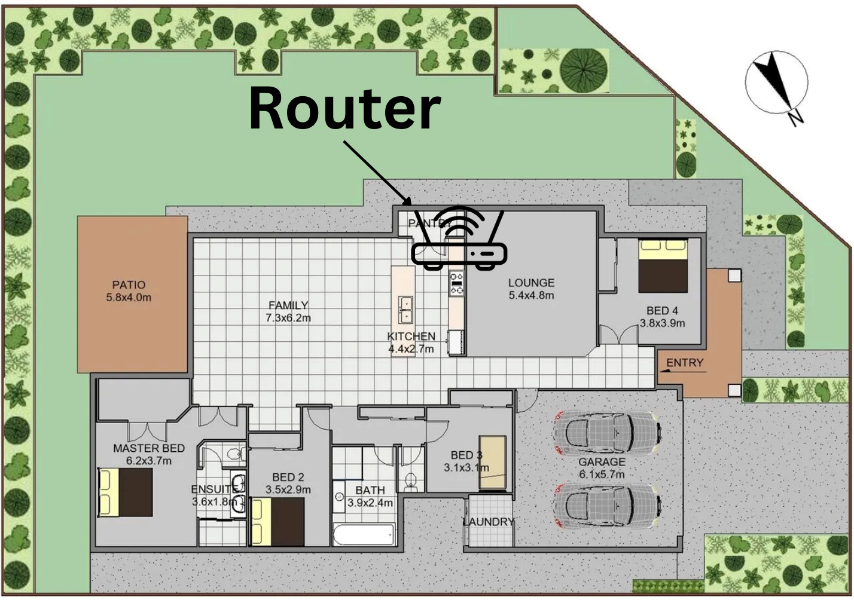
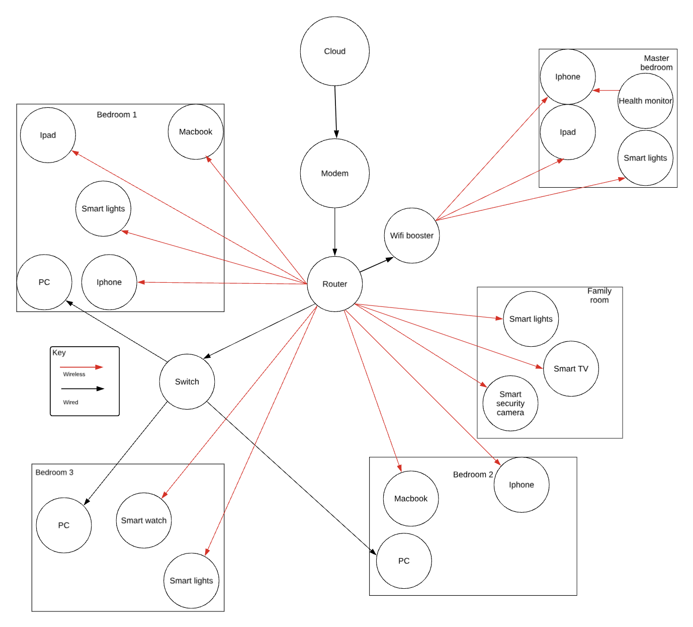
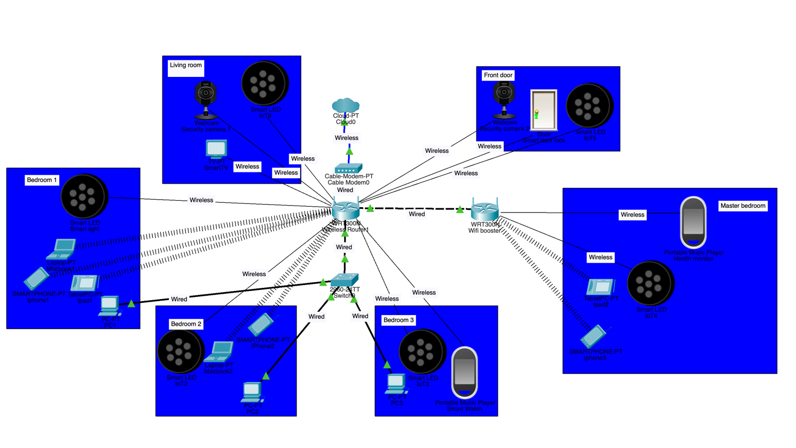

# Assessment Task 2
## Networking Systems and Social Computing

| | |
| --- | --- |
| **Student Name:** | Danny Yu |
| **Class:** | 11 CMP01 |
| **Due Date:** | Friday, 19/06/2026 – Week 9, Period 2 |

---

Project Management
To ensure the successful completion of this smart home network project, project management tools were used to plan, monitor, and organise tasks throughout the design process.
### Project Stages

- Investigation of current home network
- Identification of network issues
- Research into smart home technologies
- Design of the new smart home network
- Creation of network diagrams
- Cisco Packet Tracer simulation
- Research into cloud, edge computing, AI, IoT and IoMe
- Security planning
- Social, ethical and legal analysis
- Final report preparation
### Gantt Chart

The Gantt chart was used to schedule tasks, monitor progress, and ensure all components of the project were completed before the submission date.
## Model – Network Diagrams

### Current Home Network Diagram

### Current Network Device List

Device Name
- 3 x iPhone
- 3 x PC
- 2 x MacBook
- 2 x iPad
- 1 x Smart tv
- 1 x switch

### Where is your router placed? Why is it in that location?

The router has been installed outside the pantry due to its central location within the house and its proximity to the nearest Ethernet port. This placement helps provide more consistent Wi-Fi coverage across the home

Router specifications:
Router specs: Archer C1200
AC1200 Wireless Dual Band Gigabit Router
https://www.tp-link.com/au/service-provider/wireless-routers/archer-c1200/#specifications

Identified Problems with Current Network:
- weak signal in the master bedroom
- no smart devices
- slow speed
- devices drop out randomly
- A potential weakness in the network is the use of weak passwords, which could allow unauthorised users to gain access to sensitive systems and data.
- no smart devices to ensure user comfortability and needs

### New Smart Home Network Diagram

Section 2: Simulation – Cisco Packet Tracer
File is in attachments

Section 3: Network Plan and Explanation
### Describe the type of network used (wired, wireless, or mixed). How is data transmitted in a wired and wireless network system?

In a wired network, electrical signals transmit information via Ethernet cables. Information in this case is broken into smaller packets and is transported from one device to another using TCP/IP protocols. Transmission Control Protocol makes sure that information packets arrive safely, while Internet Protocol addresses packets and ensures they get to the right destination. Wired networks are much faster than wireless ones, are more secure, and are not affected by any form of interference.

In wireless networks, information is also broken into packets and is transmitted via Wi-Fi standards over radio waves. In a wireless network, the router sends out information in the form of radio waves and can receive information back in the same way. Information packets are managed using TCP/IP protocols. As a result, the smart camera, smart lighting, smart door lock, and health monitor can communicate among themselves and even gain access to the internet. Moreover, the information can be sent to the cloud for further analysis using a smartphone application.

For my smart house project, I would opt for the hybrid network architecture due to its ability to offer the reliability and high speeds of a wired network connection, but at the same time being able to place smart appliances anywhere in the house without the need for any cables.

### Research topologies and pick one for your network.

I have selected a star topology for my smart home network architecture. In this case, all the devices in the network are connected to the central device. The router serves as the main device in the star topology, and all the other devices such as the smart security cameras, smart door lock, smart lights, smart watch, health monitor, smart phones, laptops, and smart TV are connected to it using Ethernet cables or wirelessly via Wi-Fi.

Star topology provides the best network solution for my smart home for several reasons. First, it is very easy to manage. Second, it offers a high level of network reliability since if one of the devices stops working, the rest of the network can operate as intended. For instance, if one smart camera fails, other devices such as the smart door lock, health monitor, and other devices will work just fine.

Another benefit is that troubleshooting is made easy since all the data on the network goes through the central router. The router can provide security measures, including firewalls, encryption, and access controls, for protecting the smart home devices from any unwanted intrusions. Since there are numerous IoT and IoMe devices in my smart home, the use of star topology is ideal for achieving efficient operations.

### Reasons for Selecting Star Topology:

- Ease of installation and maintenance.
- Suitable for several wired and wireless connections.
- Failure of a single device does not interfere with the entire network.
- Ensures optimum performance and efficiency.
- Compatible with smart homes and Wi-Fi networks.
- Can accommodate more devices in the future.

### Identify and justify all hardware devices needed for setting up your network. How will you connect all these hardware devices?

| **Hardware Device** | **Function** | **Why It Is Needed** |
| --- | --- | --- |
| Modem | Connects the home network to the Internet Service Provider (ISP). | Provides internet access for all devices in the smart home. |
| Wireless Router (TP-Link Archer C1200) | Manages network traffic and provides Wi-Fi connectivity. | Acts as the central device in the star topology, allowing all devices to communicate and access the internet. |
| Network Switch | Expands the number of available Ethernet ports. | Allows multiple wired devices to connect to the network if additional ports are required. |
| Smart Security Cameras | Monitor and record activity around the home. | Improve home security by allowing remote monitoring through a mobile app. |
| Smart Door Lock | Allows doors to be locked and unlocked remotely. | Increases convenience and security by controlling access to the home. |
| Smart Lights | Can be controlled remotely or automated. | Improve comfort, energy efficiency, and convenience for users. |
| Smart Watch (IoMe Device) | Tracks health and activity data. | Allows users to monitor fitness and receive notifications. |
| Health Monitor (IoMe Device) | Records health information such as heart rate and activity levels. | Helps users track their health and wellbeing through connected applications. |
| Smartphones | Control smart home devices through apps. | Act as the primary method for managing and monitoring the smart home remotely. |
| Laptops/PCs | Access network settings, cloud services, and device management platforms. | Allow advanced control and configuration of the smart home network. |

All devices in the smart home are connected using a star topology, with the wireless router acting as the central hub. The modem connects to the internet through the ISP and is linked to the router using an Ethernet cable. The router then provides Wi-Fi access to all wireless devices, including the smart security cameras, smart door lock, smart lights, smart watch, health monitor, smartphones, laptops, and iPads.

The smart watch and health monitor send health data to a smartphone, which can then upload the information to cloud services for storage and analysis. The smart security cameras transmit live video footage through the router to the homeowner's mobile app, allowing remote monitoring. The smart door lock communicates with the router so it can be locked or unlocked remotely through a smartphone app. Smart lights receive commands from the smartphone or smart home app through the router, allowing users to control lighting from anywhere. PCs and laptops can also connect to the router to manage network settings and monitor connected devices. All data travels through the router using the TCP/IP protocol, allowing devices to communicate with each other, access cloud services, and provide real-time smart home functionality. The PCs will be connected using Ethernet cables through a network switch. Other wireless and smart devices will be connected to the internet with Wi-Fi (2.4ghz) to allow for further range.

### How many access points or Wi-Fi boosters do you need? Will you use a mobile app or voice assistant to control devices?

One Wi-Fi booster (wireless range extender) will be installed in the hallway between the router and the master bedroom. This location has been selected because the current network experiences weak signal strength in the master bedroom.
The booster will receive a strong signal from the main router and transmit it to surrounding rooms, increasing wireless coverage throughout the house. This ensures that devices such as smart security cameras, smart lights, smartphones, smartwatches, health monitors, and tablets maintain a stable connection.
The Wi-Fi booster also improves network reliability by reducing dead zones and minimising connection dropouts. Future expansion is possible by adding additional access points if more smart devices are installed or if the home network grows.

### How will you keep the network safe? (e.g., strong passwords, guest networks)

To ensure the safety of the smart home network, some security measures will be employed. Such measures include using passwords, firewall, and two-factor authentication. The mentioned measures will help to secure the smart home network and the data generated by the security cameras, smart door lock, smart watch, and health monitor used in the system.

#### Using Strong Passwords and WPA3 Encryption

Smart home devices and user accounts will use passwords consisting of random combinations of alphanumeric characters and special symbols. WPA3 will be implemented in the wireless network to provide encryption that ensures users cannot access the Wi-Fi network and data transmitted within it without authorisation.

#### Using the Router Firewall

By means of the router's firewall, the network's traffic will be monitored to detect and block any suspicious activities related to hacking, malware infections, or other cybersecurity issues.

#### Implementing Two-Factor Authentication (2FA)

Two-factor authentication will be applied to user accounts to make sure that any third party would not be able to gain access to the smart home devices or data stored in the cloud storage services used in this case study.

#### Guest Network

An isolated Wi-Fi guest network will be established specifically for their use. Guests will be able to use the internet but will not have access to our smart home technology or any private information. The separation between the guests' connection and ours will decrease potential threats and vulnerabilities.

The use of passwords, encryption, a firewall, two-factor authentication, and a guest network will ensure that our smart home network is protected from any unauthorised connections, cyberattacks, or data theft.

## Section 4: Cloud and Data Use

### Explain how data from IoMe and IoT devices will be stored and used.

In my smart home, data from both IoT (Internet of Things) and IoMe (Internet of Me) devices will be collected, stored, and used to improve convenience, security, energy efficiency, and personal wellbeing.
IoT devices such as smart security cameras, smart door locks, and smart lights generate data about activity within the home. For example, security cameras record video footage and motion detection events, while smart door locks record when doors are locked or unlocked. This data is transmitted through the home network and stored in cloud databases and mobile applications. Security footage may also be stored locally on the camera or network storage device before being backed up to the cloud. Storing this information allows homeowners to review past events, receive alerts, and remotely monitor their property.
IoMe devices such as a smartwatch and health monitor collect personal health information including heart rate, physical activity, sleep patterns, and fitness achievements. This data is first stored on the wearable device and synchronised with a smartphone through a wireless connection such as Bluetooth. The information is then uploaded to secure cloud servers where it can be stored long-term, backed up automatically, and analysed to identify health trends over time.
Authorised users can access cloud-stored data through mobile applications from any location with an internet connection. For example, homeowners can view live security camera footage, check door lock status, control smart lighting, and monitor health information collected from wearable devices. By collecting, storing, and analysing this data, the smart home can improve safety, convenience, energy management, and overall quality of life for residents.

### Show what data goes to the cloud and what stays local (edge computing) and its benefits.

| **Data Stored in the Cloud** | **Data Processed Locally (Edge Computing)** |
| --- | --- |
| Smartwatch health history and fitness records | Smart door lock locking and unlocking commands |
| Health monitor data backups | Smart light on/off and brightness controls |
| Security camera video recordings and backups | Motion detection processing by security cameras |
| Security alerts and notifications | Live communication between devices and the router |
| Smart home settings and user preferences | Immediate device responses and automation routines |

Both cloud computing and edge computing technologies are utilised in my smart home. Information that requires storing and accessing remotely is uploaded to cloud computers. For instance, the data collected from a smartwatch and health monitor can be uploaded to cloud servers where it can be easily backed up and analysed. The video data obtained from security cameras may be also stored in the cloud computer in case it becomes necessary to view footage remotely after some security event occurred.

Edge computing is applied to tasks requiring immediate actions. For example, unlocking the door with the help of smart door lock or switching a smart light on is done immediately via the local network instead of sending the signal to the cloud server first. In addition, motion detection can be executed locally by a security camera.

Among the advantages of cloud computing are remote access, automatic backup feature, huge storage capacity, and possibility of accessing the information wherever the person is. Among the advantages of edge computing are instant reaction, improved privacy, saving the internet traffic, and continuous functioning regardless of the current condition of the internet connection.

Using both cloud computing and edge computing provides the best balance between performance and functionality. Edge computing allows devices to respond instantly without relying on the internet, while cloud computing provides long-term storage, remote access, backups, and advanced data analysis. Combining both technologies improves reliability, efficiency, and user experience within the smart home.

### Describe how data is secured within the smart home with examples by referring to: Encryption and Access control

Sensitive information on my smart home devices will be safeguarded through the implementation of encryption and access control measures, ensuring that only authorised individuals gain access to it. This is especially critical since some of the devices like the smart security cameras, smart door lock, smartwatch, and health monitor generate sensitive information.

Encryption refers to the transformation of data into a code form such that only authorised individuals or devices possessing the right decryption key can understand the content of the encoded data. My smart home network will utilise WPA3 encryption for secure wireless communication between the smart home's router and other smart devices. Information that flows from my smartwatch, health monitor, smart door lock, and security cameras to my mobile phone or cloud services will also be encrypted.

Access Control involves the prevention of unauthorised access to information and devices. Passwords will be made mandatory across all devices within the system, and two-factor authentication (2FA) will also be used in the mobile apps and cloud-based solutions. Two-factor authentication will ensure that a password will need to be provided, as well as a confirmation of the person's identity, which involve entering a verification code sent to a phone. In addition, different access rights can be given to ensure that only authorised family members can use specific devices, for instance, watch security camera footage, unlock a door, or configure the home automation network.

For example, when a security camera uploads video footage to the cloud, the data is encrypted during transmission and storage. Only authorised users who have the correct login credentials and 2FA verification can access the footage through the mobile app. Similarly, health data collected by the smartwatch and health monitor is encrypted and can only be viewed by the account owner. By combining encryption and access control, the smart home network protects user privacy and reduces the risk of unauthorised access or data breaches.

### Choose 3 innovative technologies and explain how each has influenced the smart home (IoT/IoMe).

#### 1. Cloud Computing

Cloud computing refers to the use of the internet to provide storage, software, and computation resources instead of a local machine. In my smart home, cloud computing helps store information from the smartwatch, health monitor, smart security cameras, and smart door lock on the internet in a secure manner. For instance, Information from the smartwatch is transferred to a cloud server, where analysis will be carried out using a mobile application. The cloud computing technology offers the advantage of accessing information from the smart home remotely regardless of location, as long as there is an internet connection.

#### 2. Edge Computing

In edge computing, computation is performed closer to the data source rather than computing all data in the cloud. In my smart home, the smart security cameras and smart door lock can perform computation locally through the home network. For instance, the smart camera can detect any movement near the smart home premises and notify me instantly, without waiting for the data to go to the cloud.

#### 3. Artificial Intelligence (AI)

Artificial Intelligence (AI) is an upcoming technology that allows computers and devices to perform tasks that normally require human intelligence, such as recognising patterns and making decisions. In my smart home, AI is used by security cameras to identify and distinguish between people, pets, and vehicles. It can also analyse data collected from the smartwatch and health monitor to provide personalised health insights and recommendations. This makes the smart home more intelligent, efficient, and responsive to the user's needs.
These technologies work together to make my smart home more secure, convenient, and efficient. Cloud computing provides storage and remote access, edge computing delivers fast local processing, and AI helps devices make smarter decisions based on the data they collect.

Social, Ethical and Legal Implications
| **Area** | **Positive Impact** | **Negative Impact** |
| --- | --- | --- |
| **Individual (Privacy & Personal Wellbeing)** | Smart security cameras and door locks improve home security and provide peace of mind. Smartwatches and health monitors help track wellbeing. Smart lights increase convenience and energy efficiency. | Personal data such as health records, camera footage, and access logs may be collected and stored. If security fails, unauthorised users could access sensitive information. |
| **Society** | Smart home technology improves quality of life through safety, convenience, and accessibility. Health-monitoring devices support healthier lifestyles and independent living. | Increased reliance on technology may reduce privacy and raise concerns about constant monitoring. Smart home systems can be unaffordable for some people, contributing to a digital divide. |
| **Environment** | Smart lights and automation can reduce energy use by switching devices off when not needed. This can lower electricity usage and environmental impact. | Smart devices consume power continuously and generate electronic waste when outdated. Manufacturing devices also uses resources and energy. |
| **Legal** | Consumer protection laws help ensure smart home products are safe and reliable. Data protection laws require companies to handle personal information responsibly. | Companies collecting user data must comply with privacy laws. A hack or data leak may lead to legal issues around responsibility and liability. |

Smart home networks provide many benefits for individuals by improving security, convenience, and health monitoring through devices such as smart security cameras, smart door locks, smartwatches, and health monitors. However, these devices collect large amounts of personal data, creating privacy concerns if the information is not properly protected.
Ethically, homeowners must ensure that cameras and monitoring devices are used responsibly and do not infringe on the privacy of family members, visitors, or neighbours.

## Relevant Australian Laws

Several Australian laws and regulations apply to smart home networks.
Privacy Act 1988 (Cth)This law regulates how organisations collect, store, and manage personal information. Smart home providers that collect user data must ensure that personal information is handled securely and only used for authorised purposes.
Australian Privacy Principles (APPs)The Australian Privacy Principles require organisations to protect personal information from misuse, loss, unauthorised access, modification, or disclosure.
Consumer Law (Australian Consumer Law - ACL)Smart home products must be safe, reliable, and perform as advertised. Consumers have rights to repairs, replacements, or refunds if products fail to meet acceptable standards.
These laws help protect users and ensure that manufacturers and service providers are responsible for securing personal information collected through smart home technologies.
## Conclusion – Why This Design Works

My new smart home network design is a significant improvement over the original network because it provides greater speed, reliability, security, accessibility, and smart functionality.
The original network experienced several limitations, including weak Wi-Fi coverage in the master bedroom, random device dropouts, slow internet performance, and the absence of smart home technologies. In addition, the original network relied on basic connectivity with limited security features and offered little control or monitoring of devices within the home.
The redesigned network solves the problems by introducing a hybrid wired and wireless architecture based on a star topology. Wired Ethernet connections provide high speed and reliable performance for desktop computers, while wireless connectivity allows flexibility for smart devices throughout the home. Compared to the original network, which struggled with inconsistent coverage, the addition of a Wi-Fi booster improves signal strength, eliminates dead zones, and provides stable connectivity in all rooms.
The new smart home network also introduces a range of IoT and IoMe devices that were not available in the original design. Smart security cameras, smart door locks, smart lights, smartwatches, and health monitors that provide enhanced security, convenience, energy efficiency, and health monitoring. Unlike the original network, which only provided internet access, the new design creates a connected ecosystem where devices can communicate, automate tasks, and respond intelligently to user needs.
Security has also been significantly improved. The original network was vulnerable to weak passwords and lacked advanced security controls. In contrast, the new design uses WPA3 encryption, strong passwords, firewall protection, two-factor authentication, and a dedicated guest network. These measures help protect personal information, prevent unauthorised access, and reduce cybersecurity risks.
Cloud computing provides secure storage, remote access, automatic backups, and data analysis, while edge computing enables immediate responses for smart lighting, door lock control, and motion detection. Together, these technologies improve efficiency, reduce latency, and ensure that important smart home functions continue to operate effectively. The original network did not have these capabilities and therefore could not support advanced smart home features.
Overall, the redesigned smart home network is faster, more reliable, more secure, and significantly more functional than the original network. It not only addresses the weaknesses of the previous design but also provides a scalable foundation for future smart devices and technologies. By combining networking technologies, cloud computing, edge computing, IoT, IoMe, and strong security measures, the design delivers an effective and intelligent smart home solution that improves convenience, safety, efficiency, and quality of life for all users.
