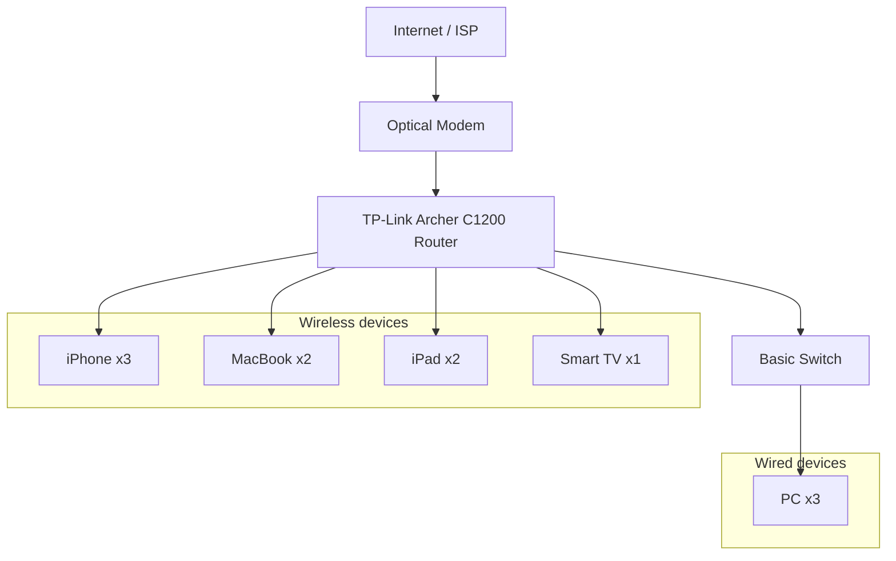
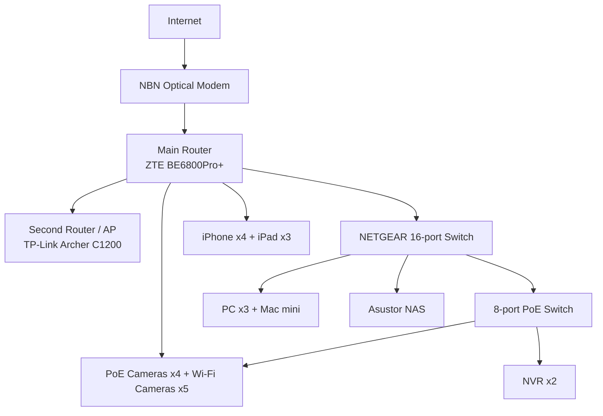
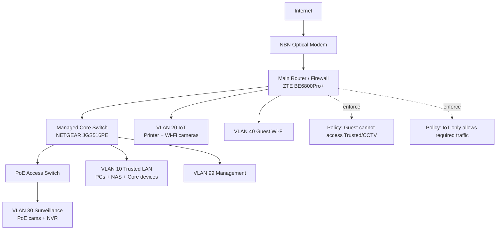

# Assessment Task 2: Networking Systems and Social Computing

> **Status:** Final Submission Version  
> **Student Name:** Danny Yu  
> **Class:** 11 CMP01  
> **Due Date:** Friday, 19/06/2026 – Week 9, Period 2

---

## Executive Summary

This report presents a comprehensive upgrade plan for a home network to support a modern smart home environment. The current network, consisting of a basic TP-Link Archer C1200 router and switch, suffers from weak signal coverage, slow speeds, random device dropouts, and limited security. The proposed solution addresses these deficiencies while introducing smart home capabilities, surveillance systems, and edge computing infrastructure.

The upgraded design implements a hybrid star topology with wired backbone connections for critical devices and Wi-Fi for flexible device placement. Key improvements include:
- A new high-performance main router (ZTE BE6800Pro+) with the existing Archer C1200 repurposed as a Wi-Fi access point
- Network segmentation using VLANs to separate trusted devices, IoT systems, surveillance, guest access, and management traffic
- Local edge computing with Raspberry Pi and Jetson devices for real-time automation and AI processing
- A comprehensive surveillance system with both PoE and Wi-Fi cameras connected to dedicated NVRs
- Centralised storage via an Asustor Flashstor 6 NAS

This design balances performance, security, privacy, and scalability while addressing social, ethical, and legal considerations. The network is validated through Cisco Packet Tracer simulation and follows industry best practices for home network security as recommended by the Australian Cyber Security Centre (ACSC, 2024).

---

## Table of Contents

1. [Executive Summary](#executive-summary)
2. [Network Diagrams](#network-diagrams)
   2.1 [Current Home Network](#current-home-network-diagram)
   2.2 [Identified Problems](#identified-problems-with-the-current-network)
   2.3 [New Smart Home Network Diagram](#new-smart-home-network-diagram)
3. [Simulation: Cisco Packet Tracer](#simulation-cisco-packet-tracer)
4. [Network Plan and Explanation](#network-plan-and-explanation)
   4.1 [Network Type and Data Transmission](#network-type-and-data-transmission)
   4.2 [Topology Selection](#topology-selection)
   4.3 [Hardware Devices and Connections](#hardware-devices-and-connections)
   4.4 [Addressing and Security Zones](#addressing-and-security-zones)
   4.5 [Wi-Fi Coverage and Control Methods](#wi-fi-coverage-and-control-methods)
   4.6 [Network Security](#network-security)
5. [Cloud and Data Use](#cloud-and-data-use)
   5.1 [Data Storage and Use](#data-storage-and-use)
   5.2 [Cloud vs Edge Computing](#cloud-vs-edge-computing)
   5.3 [Data Security](#data-security)
6. [Innovative Technologies](#innovative-technologies)
7. [Social, Ethical, and Legal Implications](#social-ethical-and-legal-implications)
8. [Conclusion](#conclusion)
9. [References](#references)
10. [Appendices](#appendices)

---

## Network Diagrams

### Current Home Network Diagram

**Figure 1** presents the existing home network architecture before the smart home upgrade. The network is a simple star topology with a single TP-Link Archer C1200 router as the central hub, connected to a basic switch for wired devices.



### Current Network Device Inventory

| Device Type | Quantity |
|-------------|----------|
| iPhone | 3 |
| PC | 3 |
| MacBook | 2 |
| iPad | 2 |
| Smart TV | 1 |
| Network Switch | 1 |

### Router Placement

The TP-Link Archer C1200 router is currently installed outside the pantry, a location chosen for its central position in the house and proximity to the nearest Ethernet port. This placement was intended to provide consistent Wi-Fi coverage, but signal degradation still occurs in distant rooms such as the master bedroom.

### Router Specifications

- **Router model:** TP-Link Archer C1200
- **Type:** AC1200 Wireless Dual Band Gigabit Router
- **Wi-Fi standards:** 802.11ac (5 GHz) and 802.11n (2.4 GHz)
- **Source:** (TP-Link, 2024)

### Identified Problems with the Current Network

The current network was evaluated against the requirements for a modern smart home, and the following deficiencies were identified:

1. **Weak signal coverage in the master bedroom** – Signal attenuation through walls and distance from the router causes unreliable connections
2. **No smart device support** – The network is not designed for IoT devices, automation, or surveillance systems
3. **Slow internet speeds** – The single router struggles with concurrent high-bandwidth activities
4. **Random device dropouts** – Wi-Fi instability causes frequent disconnections
5. **Inadequate security** – Weak passwords and lack of network segmentation expose the network to unauthorised access
6. **No automation capabilities** – No support for smart home conveniences or energy efficiency features

These issues demonstrate that the current network is sufficient for basic internet access but not for a modern smart home. In particular, it lacks reliable coverage, dedicated capacity for high-bandwidth devices, and proper security separation between trusted and untrusted devices (NIST, 2023).

### New Smart Home Network Diagram

**Figure 2** illustrates the proposed upgraded smart home network architecture. The design maintains the simplicity of a star topology while adding enhanced Wi-Fi coverage, network segmentation, local storage, edge computing, and a layered security approach.

```mermaid
graph TD
      Internet[Internet / ISP Cloud]
      NBN["NBN Optical Modem (4x UNI-D)"]
      RouterMain["Main Router: ZTE BE6800Pro+"]
      Router2["Second Router / AP: TP-Link Archer C1200"]
      SwitchCore["Switch 1: NETGEAR JGS516PE (16-port, PoE)"]
      SwitchPoE["Switch 2: 8-port 120W PoE"]

      Internet -->|fiber| NBN
      NBN -->|UNI-D1 (wired)| RouterMain
      RouterMain -->|LAN (wired)| Router2
      RouterMain -->|LAN (wired)| SwitchCore
      SwitchCore -->|uplink (wired)| SwitchPoE

      subgraph CoreCompute["Core Compute and Storage"]
         NAS["Asustor Flashstor 6 NAS (FS6706T)"]
         PC1["PC-1 Dad AMD + RTX3090"]
         PC2["PC-2 Younger Brother Intel + RTX5070"]
         PC3["PC-3 Brother Intel + RTX3060"]
         MacMini["Mac mini M4 (dev)"]
         PS4["Sony PS4"]
         Xbox["Xbox"]
         CanonPrinter["Canon G3830 Wi-Fi Printer"]

         SwitchCore -->|wired| NAS
         SwitchCore -->|wired| PC1
         SwitchCore -->|wired| PC2
         SwitchCore -->|wired| PC3
         SwitchCore -->|wired| MacMini
         SwitchCore -->|wired| PS4
         SwitchCore -->|wired| Xbox
         RouterMain -->|wireless| CanonPrinter
      end

      subgraph EdgeAI["Edge AI and Home Automation"]
         RPi5["Raspberry Pi 5"]
         Jetson2G["Jetson Nano 2GB"]
         Jetson4G["Jetson Nano 4GB"]
         HAHost["Asus Notebook (Home Assistant)"]

         SwitchCore -->|wired| RPi5
         SwitchCore -->|wired| Jetson2G
         SwitchCore -->|wired| Jetson4G
         SwitchCore -->|wired| HAHost
      end

      subgraph Surveillance["Surveillance and Security"]
         NVR1["Xiongmai 16-ch NVR (PoE)"]
         NVR2["ANNKE 4-ch NVR (Wi-Fi cams)"]
         CamTuya["Tuya 4K Wi-Fi Floodlight Cam"]
         CamPoe["Xiongmai PoE Cameras x4"]
         CamAnnke["ANNKE Wi-Fi Cameras x4"]

         SwitchPoE -->|PoE + data| CamPoe
         SwitchPoE -->|wired| NVR1
         RouterMain -->|wired| NVR2
         RouterMain -->|wireless| CamTuya
         RouterMain -->|wireless| CamAnnke
         HAHost -. app control .-> CamTuya
      end

      subgraph PersonalDevices["Personal Devices"]
         iPhones["iPhone x4"]
         iPads["iPad x3"]

         RouterMain -->|wireless| iPhones
         RouterMain -->|wireless| iPads
         Router2 -->|extended Wi-Fi| iPhones
         Router2 -->|extended Wi-Fi| iPads
      end
```

### Alternative Diagram A: Simplified Marking Version

**Figure 3** provides a simplified view of the network architecture, focusing on main device groups and backbone connections for clarity.



### Alternative Diagram B: Segmented Security Architecture

**Figure 4** illustrates the network from a security perspective, showing how VLAN segmentation reduces risk by isolating different device categories.



---

## Simulation: Cisco Packet Tracer

A Cisco Packet Tracer simulation was developed to validate the proposed network design before physical implementation. The simulation models the network shown in Figure 2 and tests connectivity, coverage, and security segmentation.

### Simulation Objectives

The Packet Tracer model validates four key requirements:

1. **End-to-end connectivity** – Verifies internet access from both wired and wireless clients
2. **Stable backbone communication** – Ensures reliable communication between routers, switches, and access points
3. **Security separation** – Confirms that guest devices cannot access internal trusted systems
4. **Smart home functionality** – Tests camera access, mobile device control, and local automation traffic

### Proposed Addressing Plan

The network uses RFC 1918 private IP addressing with VLAN segmentation to separate traffic types:

| Zone | Subnet | Typical Devices | Validation Focus |
|------|--------|-----------------|------------------|
| Trusted LAN | 192.168.10.0/24 | PCs, Mac mini, NAS, Home Assistant | File access, low latency, full internal access |
| IoT / Smart Devices | 192.168.20.0/24 | Printer, smart lights, app IoT | Internet only, limited trusted LAN access |
| Surveillance | 192.168.30.0/24 | PoE cameras, NVRs | Video stream stability, restricted lateral movement |
| Guest Wi-Fi | 192.168.40.0/24 | Visitor devices | Internet only, no internal access |
| Management | 192.168.99.0/24 | Router/switch admin | Admin-only access with strong authentication |

If full VLAN support is unavailable on all devices, the same security objectives can be achieved using separate SSIDs, router firewall rules, and managed switching where possible (Cisco, 2023).

---

## Network Plan and Explanation

### Network Type and Data Transmission

A **hybrid network architecture** is recommended, combining wired Ethernet connections and wireless Wi-Fi technology.

#### Wired Network Characteristics

In a wired network, data is transmitted as electrical signals over Ethernet cables (typically Cat 5e or Cat 6). Information is divided into packets and transported using the TCP/IP protocol suite:
- **Transmission Control Protocol (TCP)** ensures reliable, ordered delivery of packets with error checking
- **Internet Protocol (IP)** addresses each packet and routes it to the correct destination

Wired networks offer:
- Higher speeds (typically 1 Gbps or 10 Gbps)
- Greater security (less vulnerable to eavesdropping)
- Immunity to wireless interference
- Consistent, low-latency performance

#### Wireless Network Characteristics

Wireless networks use radio waves (Wi-Fi standards such as 802.11ax or 802.11ac) to transmit data packets. Like wired networks, they rely on TCP/IP protocols for communication.

Wireless networks provide:
- Flexible device placement without cabling
- Support for mobile devices
- Convenient access for guests and temporary devices

#### Hybrid Network Justification

The hybrid approach leverages the strengths of both technologies:
- Critical devices (NAS, PCs, NVRs, edge computing nodes) use wired connections for stability and throughput
- Mobile devices, cameras in difficult locations, and convenience-focused IoT devices use Wi-Fi for flexibility

This design follows the principle of using the right technology for each use case, optimising both performance and practicality.

### Topology Selection

A **star topology** has been selected as the network architecture. In this topology, the main router acts as the central hub, with all devices connecting directly or through downstream switches and access points.

#### Advantages of Star Topology

1. **Simple installation and maintenance** – Each device connects to a central point
2. **Fault isolation** – A single device failure does not disrupt the entire network
3. **Easy troubleshooting** – Problems can be traced to specific ports or devices
4. **Centralised security** – Security policies can be enforced at the router
5. **Hybrid support** – Accommodates both wired and wireless devices
6. **Scalability** – Additional devices can be added easily (Cisco, 2023)

The star topology is particularly appropriate for home environments because it matches how consumer routers and switches are typically deployed. For example, if a PoE camera fails, only that port needs testing without affecting other network services.

### Hardware Devices and Connections

The following table summarises the key hardware components in the upgraded network:

| Hardware Device | Function | Rationale |
|-----------------|----------|-----------|
| NBN Optical Modem | Connects home to ISP fibre network | Provides high-speed internet uplink |
| Main Router (ZTE BE6800Pro+) | Routing, NAT, Wi-Fi 7, security policy | Central hub with advanced features |
| Second Router/AP (TP-Link Archer C1200) | Wi-Fi coverage extension | Improves signal in weak areas; reuses existing hardware |
| NETGEAR JGS516PE Switch | 16-port gigabit with PoE | Connects core devices, provides PoE budget |
| 8-port 120W PoE Switch | Dedicated PoE for surveillance | Powers PoE cameras reliably |
| Asustor Flashstor 6 NAS | Central storage and backup | Stores files, backups, and surveillance data |
| PCs and Mac mini | Compute and daily use | Require stable wired connectivity |
| Edge Devices (RPi, Jetson, HA) | Local automation and edge AI | Enables fast local response |
| Camera System | Security monitoring | Remote viewing and evidence capture |
| NVR System | Video recording and management | Centralises surveillance storage |
| iPhones/iPads | User control interface | Primary method for smart home management |
| Canon Wi-Fi Printer | Shared printing | Wireless convenience for family |

All devices connect through the star topology with the ZTE BE6800Pro+ as the main control point. High-demand devices use wired Ethernet for stability, while Wi-Fi serves mobility needs. All communication uses TCP/IP protocols, supporting internal traffic, internet access, and remote monitoring.

### Addressing and Security Zones

To improve both performance and security, the network implements **network segmentation** through VLANs and security zones. This follows the principle of least privilege, limiting access between device categories.

| Zone | Purpose | Example Devices | Main Security Rule |
|------|---------|-----------------|--------------------|
| Trusted LAN | Personal and high-value devices | PCs, Mac mini, NAS, Home Assistant | Full internal access; not reachable from guest |
| IoT Zone | Everyday smart devices | Printer, smart lights, consumer IoT | Internet only where needed; limited trusted access |
| Surveillance Zone | Cameras and recorders | PoE cameras, Wi-Fi cameras, NVRs | Only approved apps may access feeds |
| Guest Zone | Temporary visitor access | Visitor phones/tablets | Internet only; blocked from all internal zones |
| Management Zone | Administrative control | Router/switch management | Only available to authorised admin devices |

This segmentation is critical because many consumer IoT devices receive infrequent security updates and may be vulnerable. Even if one device is compromised, network limits prevent attackers from moving laterally to more sensitive systems (NIST, 2023).

### Wi-Fi Coverage and Control Methods

The TP-Link Archer C1200 is repurposed as a Wi-Fi access point to extend coverage. It should be placed in the hallway between the main router and weak-signal rooms, ensuring it receives a strong wired backhaul signal while rebroadcasting coverage to distant areas.

#### Control Methods

Smart home devices are managed through:
- **Smartphone apps** – For camera viewing, alert management, and basic controls
- **Home Assistant** – For centralised automation and local control
- **NVR interfaces** – For surveillance recording and playback
- **Router admin interface** – For network configuration and security

Reliable Wi-Fi coverage is not just for convenience—it also improves security by reducing dropouts on cameras, sensors, and control devices that might otherwise create blind spots in the home security system.

### Network Security

The smart home implements a **layered security approach** with multiple overlapping controls:

1. **Strong authentication**
   - Random alphanumeric passwords with special characters for all devices
   - Two-factor authentication (2FA) for cloud accounts and admin interfaces
   - WPA3 encryption for all wireless networks

2. **Network security**
   - Router firewall to block unsolicited incoming traffic
   - VLAN segmentation to limit lateral movement
   - Isolated guest network for visitors
   - Regular firmware updates for all network devices

3. **Operational security**
   - Disable unused ports and services
   - Remove default credentials
   - Review access logs periodically
   - Back up configurations securely
   - Use data minimisation—collect only what is needed

These controls work together to create defence in depth. No single control is perfect, but together they significantly reduce risk. This is especially important in smart homes, where many devices lack enterprise-grade security features (ACSC, 2024).

---

## Cloud and Data Use

### Data Storage and Use

The smart home generates and uses several categories of data:

1. **Operational data** – Device status, automation states, uptime logs, network statistics
2. **Security data** – Camera footage, motion events, access records, alert history
3. **Personal data** – Account details, app credentials, notification preferences, health-related information (if applicable)

IoT and surveillance devices generate much of this data. For example:
- Security cameras record continuous footage and motion-triggered events
- NVR systems index recordings and manage retention
- Home Assistant logs device states and automation triggers

This data is transmitted through the home network to:
- Local NVR and NAS storage
- Mobile apps for local viewing
- Cloud services for remote access and backups

Users can access this data through mobile applications to:
- View real-time camera footage
- Review event recordings
- Receive security alerts
- Check automation status
- Monitor network health

Data classification helps determine appropriate storage locations, retention periods, and access controls.

### Cloud vs Edge Computing

The smart home uses a **mixed cloud-edge model** to balance convenience, privacy, and reliability.

| Data Stored/Processed in Cloud | Data Stored/Processed Locally (Edge) |
|---------------------------------|--------------------------------------|
| Camera event backups and metadata | Real-time motion detection and local recording |
| Mobile push alert history | NVR local recording and indexing |
| Account configuration backups | Home Assistant local automations |
| Remote access dashboards | Edge AI inference on RPi/Jetson |
| Off-site file backups | Internal LAN communication and control |

#### Cloud Benefits

- Remote access from anywhere with internet
- Automatic off-site backups
- Scalable storage capacity
- Vendor-provided feature updates

#### Edge Benefits

- Instant response without internet round-trips
- Improved privacy (sensitive data stays local)
- Reduced internet data usage
- Continued operation during internet outages

For this smart home, time-critical functions (automations, local recording, real-time alerts) remain at the edge, while cloud services provide remote access and off-site backup resilience. This hybrid approach ensures the home remains functional even if the internet connection is interrupted (NIST, 2023).

### Data Security

Sensitive data is protected through **encryption** and **access control**:

#### Encryption

- **In transit** – WPA3 for Wi-Fi, HTTPS/TLS for web and app communication
- **At rest** – Encrypted storage on NAS and NVR where supported
- **End-to-end** – Where available for camera feeds and cloud services

#### Access Control

- Password protection on all devices and accounts
- Two-factor authentication (2FA) for cloud and admin access
- Role-based access – guests see only what they need
- Least privilege – devices have minimal necessary access

For example, when a camera uploads footage to the cloud:
1. The footage is encrypted during transmission
2. It is stored encrypted at rest
3. Only authenticated users with 2FA can view it

Additionally, **data minimisation** reduces risk. The network should store only data necessary for safety, control, or troubleshooting, with clear retention policies to delete data when it is no longer needed (ACSC, 2024).

---

## Innovative Technologies

### 1. Cloud Computing

Cloud computing delivers storage, computation, and software services over the internet rather than relying solely on local hardware. In this smart home, cloud services support:
- Remote camera viewing and alert notification
- Off-site backup of important configurations
- Account synchronisation across devices

The key benefit is **availability**—users can monitor their home from anywhere without exposing internal network services directly to the internet.

### 2. Edge Computing

Edge computing processes data close to where it is generated instead of sending everything to the cloud. In this design:
- Raspberry Pi 5 runs Home Assistant for local automation
- Jetson Nano devices perform edge AI for camera analytics
- NVR systems handle local recording without internet dependency

The key benefit is **responsiveness**—critical functions continue operating even during internet outages, and privacy is enhanced by keeping sensitive data local.

### 3. Artificial Intelligence (AI)

AI enables pattern recognition and intelligent decision-making. In this smart home:
- AI filters camera motion events to reduce false positives (e.g., ignoring pets while detecting people)
- Home Assistant uses predictive automation based on user habits
- Edge analytics reduce unnecessary cloud uploads

The key benefit is **efficiency**—AI reduces alert fatigue, prioritises important events, and automates routine tasks without constant user input.

Together, these technologies create a smart home that is not just a collection of devices, but an integrated system where networking, automation, data processing, and security design reinforce each other.

---

## Social, Ethical, and Legal Implications

| Area | Positive Impact | Negative Impact |
|------|-----------------|-----------------|
| **Privacy** | Smart cameras, NVR, and network segmentation improve home security and peace of mind. | Personal data (camera footage, network logs, access records) may be collected and stored. If security fails, unauthorised access is possible. |
| **Society** | Smart home technology improves quality of life through safety, convenience, and accessibility. | Increased reliance on technology may reduce privacy and raise concerns about constant monitoring. Smart home systems can be unaffordable for some, widening the digital divide. |
| **Environment** | Smart automation can reduce energy use by switching off unused devices. | Smart devices consume continuous power and generate e-waste when outdated. |
| **Legal** | Consumer protection and data protection laws support safer deployment. | A hack or data leak may create legal issues around privacy, responsibility, and liability. |

### Ethical Considerations

From an ethical perspective, surveillance should be proportionate and transparent. Cameras should be positioned for security purposes, not for unnecessary monitoring of family, visitors, or neighbours. Users should also understand what data third-party apps and cloud services collect before enabling features by default.

### Legal Considerations

In Australia, smart home deployment must consider:
- The **Privacy Act 1988** – regulates handling of personal information
- **Surveillance Devices Act 2004** – may apply depending on camera placement and recording
- **Australian Consumer Law** – requires products to be safe and fit for purpose

If cameras record areas where people have a reasonable expectation of privacy, additional consent or notice may be required depending on the jurisdiction.

### Social Considerations

While smart homes can improve accessibility for elderly users, busy families, and people with health needs, they can also increase dependence on commercial platforms and internet connectivity. The best design balances convenience, privacy, affordability, and user control—not just the one with the most devices.

---

## Conclusion

This report has presented a comprehensive upgrade plan for a home network to support a modern smart home. The proposed design addresses the current network's weaknesses—poor coverage, instability, limited security, and lack of automation—while introducing significant improvements.

Key recommendations include:
- A hybrid star topology with wired backbone for critical devices
- Network segmentation using VLANs to enhance security
- Local edge computing for resilience and privacy
- A layered security approach following ACSC guidance
- A balanced cloud-edge operating model
- Consideration of social, ethical, and legal implications

The upgraded network provides faster speeds, more reliable coverage, better security, and support for future expansion. It is a practical, future-proof design that meets the needs of a modern smart home while respecting privacy and security requirements.

---

## References

1. Australian Cyber Security Centre (ACSC). (2024). *Secure your smart devices and home network*. Retrieved from https://www.cyber.gov.au/
2. Cisco. (2023). *Network Topologies Overview*. Retrieved from https://www.cisco.com/
3. National Institute of Standards and Technology (NIST). (2023). *Considerations for Managing Internet of Things (IoT) Cybersecurity and Privacy Risks* (NISTIR 8228). Retrieved from https://www.nist.gov/
4. TP-Link. (2024). *Archer C1200 AC1200 Wireless Dual Band Gigabit Router Specifications*. Retrieved from https://www.tp-link.com/au/service-provider/wireless-routers/archer-c1200/#specifications
5. NETGEAR. (2024). *JGS516PE 16-Port Gigabit Easy Smart Managed Plus PoE Switch*. Retrieved from https://www.netgear.com/
6. Office of the Australian Information Commissioner (OAIC). (2023). *Privacy Act 1988 guidelines*. Retrieved from https://www.oaic.gov.au/

---

## Appendices

### Appendix A: Device Inventory Summary

See separate file: `sheets_md/3c_clean_en.md`

### Appendix B: Cisco Packet Tracer File

The Packet Tracer simulation file is included with the submission materials.

### Appendix C: Photographs of Existing Hardware

Photographs of the current router, switches, and new hardware are provided in the `PIC/` directory:
- `asustor_nas_front.jpeg` – Asustor NAS front panel
- `asustor_nas_back.jpeg` – Asustor NAS rear connections
- `nvr_recoder_front.jpeg` – NVR front panel
- `nvr_recoder_back.jpeg` – NVR rear connections
- `nvr_recoder_in.jpeg` – NVR internal view
- `poe_switch.jpeg` – PoE switch
- `home_lab_1.jpeg` – Home lab overview

### Appendix D: Additional Network Diagram Variants

- `smart_home_network_diagram_by_rooms.mmd` – Room-based layout
- `smart_home_network_diagram_simple.mmd` – High-level simplified view
