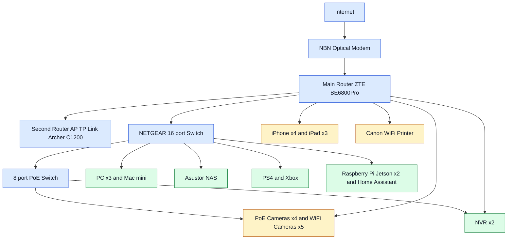

# Smart Home Network Topology Showcase

This page displays four network topology variants designed for this project. They are written using Mermaid syntax and are dynamically rendered in your browser as high-definition, interactive SVG vector diagrams. You can zoom and pan using mouse wheel / touch gestures.

---

## 1. Full Detail Diagram
This diagram shows all compute nodes, storage systems, edge AI devices, security/surveillance components, and personal mobile devices, along with their physical and logical connections in the proposed smart home network.

```mermaid
graph TD
    Internet[Internet ISP]
    NBN[NBN Optical Modem]
    RouterMain[Main Router ZTE BE6800Pro]
    Router2[Second Router AP TP Link Archer C1200]
    SwitchCore[Switch 1 NETGEAR JGS516PE 16 port PoE]
    SwitchPoE[Switch 2 8 port 120W PoE]

    Internet --> NBN
    NBN --> RouterMain
    RouterMain --> Router2
    RouterMain --> SwitchCore
    SwitchCore --> SwitchPoE

    subgraph CoreCompute[Core Compute and Storage]
      NAS[Asustor Flashstor 6 NAS FS6706T]
      PC1[PC1 Dad AMD RTX3090]
      PC2[PC2 Younger Brother Intel RTX5070]
      PC3[PC3 Brother Intel RTX3060]
      MacMini[Mac mini M4]
      PS4[Sony PS4]
      Xbox[Xbox]
      CanonPrinter[Canon G3830 WiFi Printer]

      SwitchCore --> NAS
      SwitchCore --> PC1
      SwitchCore --> PC2
      SwitchCore --> PC3
      SwitchCore --> MacMini
      SwitchCore --> PS4
      SwitchCore --> Xbox
      RouterMain --> CanonPrinter
    end

    subgraph EdgeAI[Edge AI and Home Automation]
      RPi5[Raspberry Pi 5]
      Jetson2G[Jetson Nano 2GB]
      Jetson4G[Jetson Nano 4GB]
      HAHost[Asus Notebook Home Assistant]

      SwitchCore --> RPi5
      SwitchCore --> Jetson2G
      SwitchCore --> Jetson4G
      SwitchCore --> HAHost
    end

    subgraph Surveillance[Surveillance and Security]
      NVR1[Xiongmai 16 channel NVR PoE]
      NVR2[ANNKE 4 channel NVR WiFi cameras]
      CamTuya[Tuya 4K WiFi Floodlight Camera]
      CamPoe[Xiongmai PoE Cameras x4]
      CamAnnke[ANNKE WiFi Cameras x4]

      SwitchPoE --> CamPoe
      SwitchPoE --> NVR1
      RouterMain --> NVR2
      RouterMain --> CamTuya
      RouterMain --> CamAnnke
      HAHost -. app control .-> CamTuya
    end

    subgraph PersonalDevices[Personal Devices]
      iPhones[iPhone x4]
      iPads[iPad x3]

      RouterMain --> iPhones
      RouterMain --> iPads
      Router2 --> iPhones
      Router2 --> iPads
    end

    classDef core stroke:#2563eb,fill:#dbeafe,color:#0f172a;
    classDef wired stroke:#15803d,fill:#dcfce7,color:#0f172a;
    classDef wireless stroke:#b45309,fill:#fef3c7,color:#0f172a;
    classDef smart stroke:#7c3aed,fill:#ede9fe,color:#0f172a;

    class Internet,NBN,RouterMain,Router2,SwitchCore,SwitchPoE core
    class NAS,PC1,PC2,PC3,MacMini,PS4,Xbox,NVR1,NVR2,RPi5,Jetson2G,Jetson4G wired
    class iPhones,iPads,CanonPrinter,CamAnnke wireless
    class HAHost,CamTuya,CamPoe smart
```

---

## 2. Simplified Diagram
For quick review and assessment, this version groups related client devices together and simplifies connections to focus on core trunk infrastructure paths.

---

## 3. Segmented Security Architecture
A security-focused architectural view highlighting VLAN segmentation and firewall policy enforcement. The layout isolates network traffic into Trusted LAN, IoT home devices, Surveillance networks, Guest Wi-Fi, and a dedicated Management plane.

```mermaid
graph TD
    Internet[Internet]
    NBN[NBN Optical Modem]
    RouterFW[Main Router Firewall ZTE BE6800Pro]
    CoreSwitch[Managed Core Switch NETGEAR JGS516PE]
    PoESwitch[PoE Access Switch]

    Internet --> NBN --> RouterFW --> CoreSwitch --> PoESwitch

    subgraph VLAN10[VLAN 10 Trusted LAN]
      PCs[PC x3 and Mac mini]
      NAS[Asustor NAS]
      Consoles[PS4 and Xbox]
      AdminEdge[Raspberry Pi Jetson and HA Host]
    end

    subgraph VLAN20[VLAN 20 IoT Home Devices]
      Printer[Canon WiFi Printer]
      TuyaCam[Tuya WiFi Floodlight Camera]
      AnnkeWiFi[ANNKE WiFi Cameras x4]
    end

    subgraph VLAN30[VLAN 30 Surveillance]
      CamPoE[Xiongmai PoE Cameras x4]
      NVR1[Xiongmai 16 channel NVR]
      NVR2[ANNKE 4 channel NVR]
    end

    subgraph VLAN40[VLAN 40 Guest WiFi]
      GuestPhones[Guest Mobile Devices]
    end

    subgraph VLAN99[VLAN 99 Management]
      Router2AP[TP Link Archer C1200 AP mode]
      MgmtUI[Admin Console]
    end

    CoreSwitch --> PCs
    CoreSwitch --> NAS
    CoreSwitch --> Consoles
    CoreSwitch --> AdminEdge

    RouterFW --> Printer
    RouterFW --> TuyaCam
    RouterFW --> AnnkeWiFi

    PoESwitch --> CamPoE
    PoESwitch --> NVR1
    RouterFW --> NVR2

    RouterFW --> GuestPhones
    CoreSwitch --> Router2AP
    CoreSwitch --> MgmtUI

    Policy1[Policy: Guest blocked from Trusted and Surveillance]
    Policy2[Policy: IoT only allows required cloud and app traffic]
    Policy3[Policy: Management only accessible by admin devices]

    RouterFW -. enforce .-> Policy1
    RouterFW -. enforce .-> Policy2
    RouterFW -. enforce .-> Policy3

    classDef infra stroke:#1d4ed8,fill:#dbeafe,color:#111827;
    classDef trusted stroke:#166534,fill:#dcfce7,color:#111827;
    classDef iot stroke:#b45309,fill:#fef3c7,color:#111827;
    classDef sec stroke:#7c3aed,fill:#ede9fe,color:#111827;
    classDef policy stroke:#7f1d1d,fill:#fee2e2,color:#111827;

    class Internet,NBN,RouterFW,CoreSwitch,PoESwitch,Router2AP infra
    class PCs,NAS,Consoles,AdminEdge,MgmtUI trusted
    class Printer,TuyaCam,AnnkeWiFi,GuestPhones iot
    class CamPoE,NVR1,NVR2 sec
    class Policy1,Policy2,Policy3 policy
```

---

## 4. Room-based Layout
This layout organizes network endpoints based on their actual physical distribution in the home (Garage cabinet, Living room, Study/Bedrooms, and Whole Home WiFi coverage), making physical cabling and wireless propagation areas easier to analyze.

```mermaid
graph TD
    Internet[Internet ISP]

    subgraph Garage[Garage Communication Cabinet]
      NBN[NBN Optical Modem]
      RouterMain[Main Router ZTE BE6800Pro]
      SwitchCore[Switch 1 NETGEAR JGS516PE]
      SwitchPoE[Switch 2 8 port PoE 120W]
      NVR1[Xiongmai 16 channel NVR]
      NVR2[ANNKE 4 channel NVR]
    end

    subgraph LivingRoom[Living Room]
      NAS[Asustor Flashstor 6 NAS]
      PC1[PC1 Dad AMD RTX3090]
      PS4[Sony PS4]
      Xbox[Xbox]
      CamTuya[Tuya 4K Floodlight Camera]
    end

    subgraph StudyAndBedrooms[Study and Bedrooms]
      PC2[PC2 Intel RTX5070]
      PC3[PC3 Intel RTX3060]
      MacMini[Mac mini M4]
      RPi5[Raspberry Pi 5]
      Jetson2G[Jetson Nano 2GB]
      Jetson4G[Jetson Nano 4GB]
      HAHost[Asus Notebook Home Assistant]
    end

    subgraph WholeHomeWiFi[Whole Home WiFi Devices]
      Router2[Second Router AP TP Link Archer C1200]
      iPhones[iPhone x4 family]
      iPads[iPad x3 family]
      Printer[Canon G3830 WiFi Printer]
      CamAnnke[ANNKE WiFi Cameras x4]
      CamPoe[Xiongmai PoE Cameras x4]
    end

    Internet --> NBN --> RouterMain
    RouterMain --> SwitchCore --> SwitchPoE
    RouterMain --> Router2

    SwitchCore --> NAS
    SwitchCore --> PC1
    SwitchCore --> PS4
    SwitchCore --> Xbox

    SwitchCore --> PC2
    SwitchCore --> PC3
    SwitchCore --> MacMini
    SwitchCore --> RPi5
    SwitchCore --> Jetson2G
    SwitchCore --> Jetson4G
    SwitchCore --> HAHost

    SwitchPoE --> NVR1
    RouterMain --> NVR2
    SwitchPoE --> CamPoe
    RouterMain --> CamTuya
    RouterMain --> CamAnnke
    HAHost -. app control .-> CamTuya

    RouterMain --> iPhones
    RouterMain --> iPads
    Router2 --> iPhones
    Router2 --> iPads
    RouterMain --> Printer

    classDef infra stroke:#1d4ed8,fill:#dbeafe,color:#111827;
    classDef roomdev stroke:#166534,fill:#dcfce7,color:#111827;
    classDef wifi stroke:#b45309,fill:#fef3c7,color:#111827;
    classDef iot stroke:#7c3aed,fill:#ede9fe,color:#111827;

    class Internet,NBN,RouterMain,Router2,SwitchCore,SwitchPoE infra
    class NAS,PS4,Xbox,PC1,PC2,PC3,MacMini,RPi5,Jetson2G,Jetson4G roomdev
    class iPhones,iPads,Printer,CamAnnke wifi
    class NVR1,NVR2,CamPoe,CamTuya,HAHost iot
```

