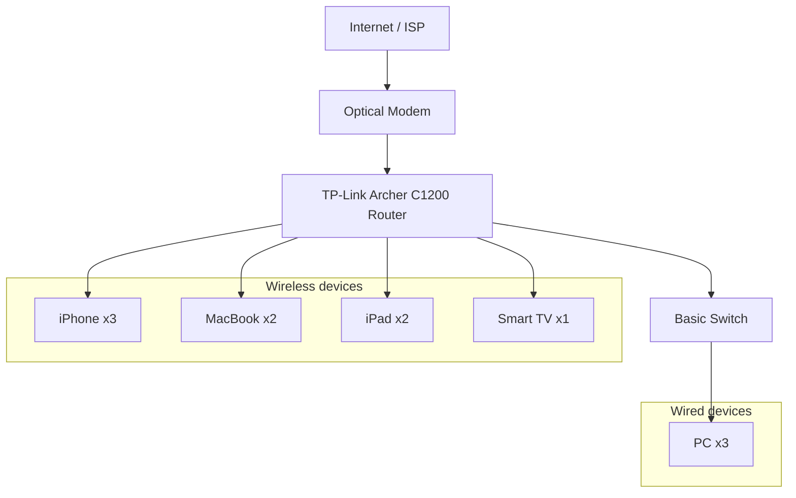
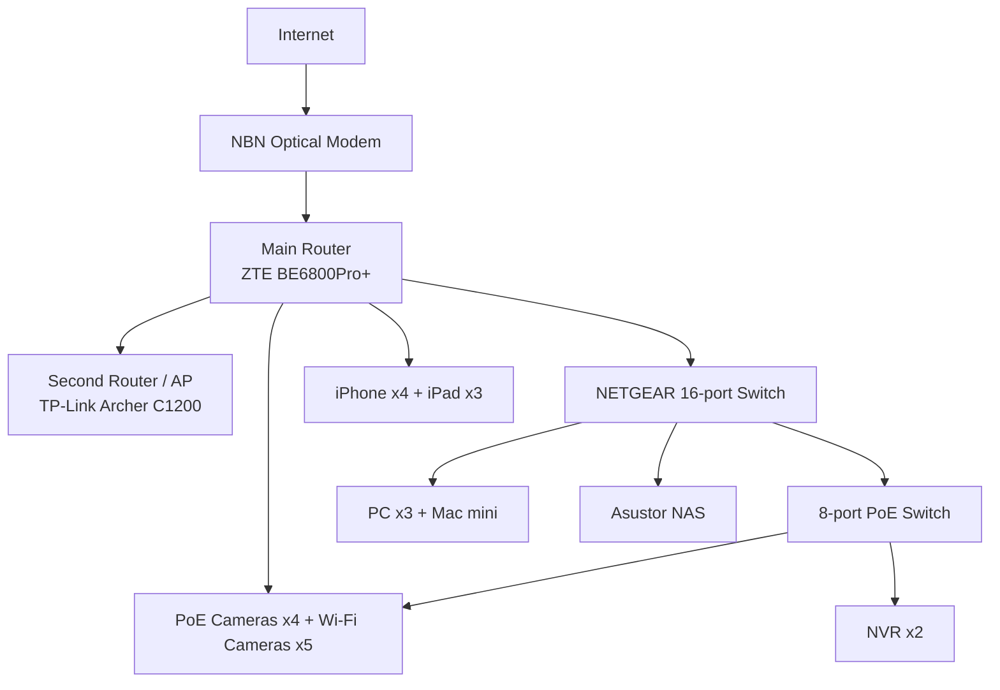
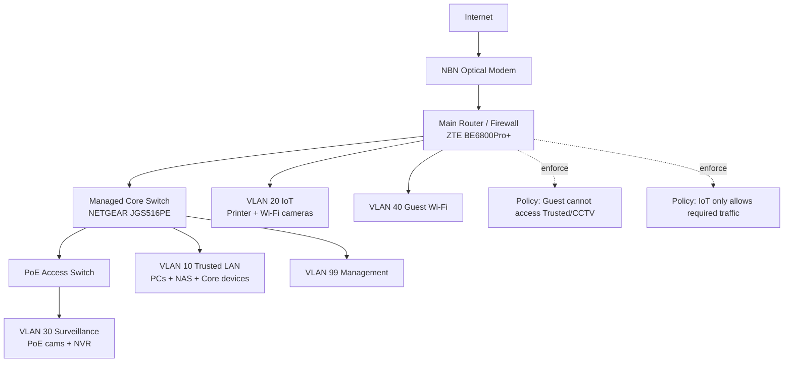

# Assessment Task 2: Networking Systems and Social Computing

> Status: Submission-oriented version. Update this file after changes in `report_draft.md` are reviewed and ready for presentation.

## Student Information
- **Name:** Danny Yu
- **Class:** 11 CMP01
- **Due Date:** Friday, 19/06/2026 – Week 9, Period 2

---

## Table of Contents
1. [Network Diagrams](#network-diagrams)
2. [Simulation: Cisco Packet Tracer](#simulation-cisco-packet-tracer)
3. [Network Plan and Explanation](#network-plan-and-explanation)
   - [Network Type](#network-type)
   - [Topology Selection](#topology-selection)
   - [Hardware Devices and Connections](#hardware-devices-and-connections)
   - [Addressing and Security Zones](#addressing-and-security-zones)
   - [Wi-Fi Boosters and Control](#wi-fi-boosters-and-control)
   - [Network Security](#network-security)
4. [Cloud and Data Use](#cloud-and-data-use)
   - [Data Storage and Use](#data-storage-and-use)
   - [Cloud vs Edge Computing](#cloud-vs-edge-computing)
   - [Data Security](#data-security)
5. [Innovative Technologies](#innovative-technologies)
6. [Social, Ethical, and Legal Implications](#social-ethical-and-legal-implications)
7. [Conclusion](#conclusion)
8. [References](#references)

---

## Network Diagrams

### Current Home Network Diagram
Figure 1 shows the current network before the smart home upgrade. It is a basic home network with one router and one switch, which explains the weak signal in the master bedroom and the lack of separation between general devices and future smart devices.



### Current Network Device List
- 3 x iPhone
- 3 x PC
- 2 x MacBook
- 2 x iPad
- 1 x Smart TV
- 1 x Switch

### Router Placement
The router is installed outside the pantry because this location is central to the house and is close to the nearest Ethernet port. This placement helps provide more consistent Wi-Fi coverage throughout the home.

### Router Specifications
- **Router model:** Archer C1200
- **Type:** AC1200 Wireless Dual Band Gigabit Router
- **Source:** https://www.tp-link.com/au/service-provider/wireless-routers/archer-c1200/#specifications

### Identified Problems with the Current Network
- Weak signal in the master bedroom
- No smart devices currently installed
- Slow internet speed
- Devices drop out randomly
- Weak passwords may allow unauthorised access to private systems and data
- No automation for comfort or energy savings

These issues show that the current network is suitable for basic internet access but not for a modern smart home. In particular, it lacks reliable coverage, dedicated capacity for high-bandwidth devices such as cameras and NAS storage, and proper security separation between trusted personal devices and less trusted IoT devices.

### New Smart Home Network Diagram
Figure 2 presents the recommended upgraded smart home design. It keeps the simplicity of a star topology while adding stronger Wi-Fi coverage, storage, edge computing, and security-focused device grouping.

```mermaid
graph TD
      Internet[Internet / ISP Cloud]
      NBN["NBN Optical Modem (4x UNI-D)"]
      RouterMain["Main Router: ZTE BE6800Pro+"]
      Router2["Second Router / AP: TP-Link Archer C1200"]
      SwitchCore["Switch 1: NETGEAR JGS516PE (16-port, PoE)"]
      SwitchPoE["Switch 2: 8-port 120W PoE"]

      Internet -->|fiber| NBN
      NBN -->|UNI-D1 (wired)| RouterMain
      RouterMain -->|LAN (wired)| Router2
      RouterMain -->|LAN (wired)| SwitchCore
      SwitchCore -->|uplink (wired)| SwitchPoE

      subgraph CoreCompute["Core Compute and Storage"]
         NAS["Asustor Flashstor 6 NAS (FS6706T)"]
         PC1["PC-1 Dad AMD + RTX3090"]
         PC2["PC-2 Younger Brother Intel + RTX5070"]
         PC3["PC-3 Brother Intel + RTX3060"]
         MacMini["Mac mini M4 (dev)"]
         PS4["Sony PS4"]
         Xbox["Xbox"]
         CanonPrinter["Canon G3830 Wi-Fi Printer"]

         SwitchCore -->|wired| NAS
         SwitchCore -->|wired| PC1
         SwitchCore -->|wired| PC2
         SwitchCore -->|wired| PC3
         SwitchCore -->|wired| MacMini
         SwitchCore -->|wired| PS4
         SwitchCore -->|wired| Xbox
         RouterMain -->|wireless| CanonPrinter
      end

      subgraph EdgeAI["Edge AI and Home Automation"]
         RPi5["Raspberry Pi 5"]
         Jetson2G["Jetson Nano 2GB"]
         Jetson4G["Jetson Nano 4GB"]
         HAHost["Asus Notebook (Home Assistant)"]

         SwitchCore -->|wired| RPi5
         SwitchCore -->|wired| Jetson2G
         SwitchCore -->|wired| Jetson4G
         SwitchCore -->|wired| HAHost
      end

      subgraph Surveillance["Surveillance and Security"]
         NVR1["Xiongmai 16-ch NVR (PoE)"]
         NVR2["ANNKE 4-ch NVR (Wi-Fi cams)"]
         CamTuya["Tuya 4K Wi-Fi Floodlight Cam"]
         CamPoe["Xiongmai PoE Cameras x4"]
         CamAnnke["ANNKE Wi-Fi Cameras x4"]

         SwitchPoE -->|PoE + data| CamPoe
         SwitchPoE -->|wired| NVR1
         RouterMain -->|wired| NVR2
         RouterMain -->|wireless| CamTuya
         RouterMain -->|wireless| CamAnnke
         HAHost -. app control .-> CamTuya
      end

      subgraph PersonalDevices["Personal Devices"]
         iPhones["iPhone x4"]
         iPads["iPad x3"]

         RouterMain -->|wireless| iPhones
         RouterMain -->|wireless| iPads
         Router2 -->|extended Wi-Fi| iPhones
         Router2 -->|extended Wi-Fi| iPads
      end
```

### Alternative Diagram A: Simplified Marking Version
Figure 3 provides a cleaner marking version that highlights only the main device groups and backbone links.



### Alternative Diagram B: Segmented Security Architecture
Figure 4 shows the same network from a security perspective. Instead of focusing on rooms or hardware count, it shows how the design reduces risk by separating trusted devices, IoT devices, surveillance devices, guests, and management traffic.



---

## Simulation: Cisco Packet Tracer

The Cisco Packet Tracer simulation file is included in the attachments. The simulation is used to test whether the proposed design in Figure 2 can deliver connectivity, coverage, and basic security separation before the network is physically installed.

The Packet Tracer model is used to verify four key requirements:
- end-to-end internet connectivity from the ISP modem to wired and wireless clients,
- stable communication between the main router, access point, and switches,
- successful device access for trusted users without exposing internal devices to guests,
- correct operation of smart home services such as camera access, mobile control, and local automation traffic.

The simulation also supports troubleshooting because each connection can be tested using packet flow and device configuration checks. This makes it easier to confirm that the star topology is working correctly and that the backbone links are placed on the most important devices first.

### Proposed Addressing and Validation Summary

**Zone** | **Example subnet** | **Typical devices** | **Validation focus**
--- | --- | --- | ---
Trusted LAN | 192.168.10.0/24 | PCs, Mac mini, NAS, Home Assistant host | File access, low latency, full internal access
IoT / Smart Devices | 192.168.20.0/24 | Printer, smart lights, app-connected IoT devices | Internet access allowed, limited access to trusted LAN
Surveillance | 192.168.30.0/24 | PoE cameras, NVR, floodlight camera | Video stream stability and restricted lateral movement
Guest Wi-Fi | 192.168.40.0/24 | Visitor phones and tablets | Internet only, no access to internal devices
Management | 192.168.99.0/24 | Router and switch administration | Admin-only access with strong authentication

If full VLAN support is not available on every device, the same security intent can still be applied using guest Wi-Fi, separate SSIDs, router firewall rules, and managed switching where supported.

---

## Network Plan and Explanation

### Network Type
A hybrid network architecture is recommended for the smart home.

- **Wired connections:** Use Ethernet cables for stability and speed.
- **Wireless connections:** Use Wi-Fi for flexible placement of smart devices.
- **Data transmission:** TCP/IP protocols divide information into packets and deliver it accurately.

A hybrid network offers the reliability of wired connections and the flexibility of wireless devices. In this design, the most important services such as NAS storage, edge computing, NVR recording, and desktop computers use wired Ethernet because they need low latency and stable throughput. Mobile devices, cameras that are difficult to cable, and convenience-focused smart devices use Wi-Fi because they benefit from flexible placement.

### Topology Selection
A **star topology** is selected for the smart home network.

- The main router acts as the central control point.
- Devices connect through the router directly or through downstream switches and an access point.

**Advantages of star topology:**
- Easy installation and maintenance
- Reliable operation if one device fails
- Simple troubleshooting
- Centralised security control
- Suitable for wired and wireless devices
- Easy future expansion

This topology is also the most practical option for a house because it matches how home routers and switches are normally deployed. Each device or device group can be traced back to a central point, making faults easier to isolate. For example, if a PoE camera fails, the user can test the PoE switch port without disrupting the rest of the network.

### Hardware Devices and Connections

**Hardware Device** | **Function** | **Reason it is needed**
--- | --- | ---
NBN Optical Modem | Connects the home to the ISP fibre network | Provides internet uplink to the internal network.
Main Router (ZTE BE6800Pro+) | Performs routing, NAT, Wi-Fi, and security policy control | Acts as the main central node of the star topology.
Second Router/AP (TP-Link Archer C1200) | Extends Wi-Fi coverage for weak signal areas | Improves whole-home wireless signal quality.
Switch 1 (NETGEAR JGS516PE) | Provides multiple wired ports and PoE support | Connects PCs, NAS, edge devices, and uplink to PoE segment.
Switch 2 (8-port 120W PoE) | Delivers PoE power and data to surveillance devices | Powers PoE cameras and links surveillance equipment.
Asustor Flashstor 6 NAS | Central storage and backup target | Stores files, backups, and surveillance-related data.
PCs and Mac mini | Development, compute, and daily use | Require stable wired connectivity and high throughput.
Edge devices (Raspberry Pi + Jetson + HA host) | Local automation and edge processing | Supports fast local response and reduced cloud dependency.
Camera system (Tuya + ANNKE + Xiongmai PoE) | Security monitoring and event capture | Enables remote monitoring and evidence recording.
NVR system (Xiongmai + ANNKE) | Video aggregation, recording, and playback | Centralises camera video management.
iPhones/iPads | Device management and remote control apps | Main user interface for control and notifications.
Canon Wi-Fi printer | Wireless shared printing | Supports family device printing without cabling.

All devices in the smart home connect using a star topology with the main router as the central control point. The NBN optical modem links to the ISP and then to the main router. The second router runs as an AP and coverage extension.

High-demand devices such as the NAS, PCs, Mac mini, NVR, and edge computing nodes connect through wired Ethernet switches. Surveillance is split into PoE cameras and Wi-Fi cameras, with both streams accessible from mobile apps.

All data travels through TCP/IP protocols across the router and switches, supporting internal communication, internet access, and remote monitoring. Wired links are used where stability and throughput are critical, while Wi-Fi is used for mobility and flexible deployment.

### Addressing and Security Zones

To improve both performance and security, the upgraded smart home should separate devices into logical zones instead of placing every device on one flat network.

**Zone** | **Purpose** | **Example devices** | **Main security rule**
--- | --- | --- | ---
Trusted LAN | Personal and high-value devices | PCs, Mac mini, NAS, Home Assistant host | Full internal access; not reachable from guest devices
IoT Zone | Everyday smart devices | Printer, smart lights, app-linked consumer IoT | Internet access only where needed; limited access to trusted LAN
Surveillance Zone | Cameras and recorders | PoE cameras, Wi-Fi cameras, NVRs | Only approved devices and apps may access camera feeds
Guest Zone | Temporary visitor access | Visitor phones and tablets | Internet only; blocked from all internal zones
Management Zone | Administrative control | Router and switch management interfaces | Only available to authorised admin devices

This zoning approach follows the principle of least privilege. A compromised smart plug or camera should not be able to move directly into the NAS, family PCs, or management interface. Even if the home uses consumer equipment, the design goal is still valid: keep high-trust devices, low-trust IoT devices, and guest devices separated as much as the hardware allows.

### Wi-Fi Boosters and Control
A second router (TP-Link Archer C1200) is used as a Wi-Fi extension node. It should be placed between the main router area and weak-signal rooms so it can receive a strong backhaul signal and rebroadcast stable coverage.

Devices are managed primarily through smartphone apps, camera platforms, and the Home Assistant app. This allows users to:
- manage security cameras,
- review NVR recordings,
- control Tuya floodlight camera functions,
- monitor automation status from Home Assistant.

This placement improves user experience because poor Wi-Fi coverage is one of the main causes of device dropouts in smart homes. Reliable coverage is not only about convenience. It also improves security by reducing disconnects on cameras, sensors, and control devices.

### Network Security
The smart home network uses the following security measures:
- strong passwords,
- router firewall protection,
- two-factor authentication (2FA),
- a separate guest Wi-Fi network,
- segmented zones for trusted, IoT, surveillance, and guest traffic.

**Security details:**
- Use random alphanumeric passwords with symbols.
- Enable WPA3 to encrypt wireless traffic.
- Configure the router firewall to block suspicious activity.
- Require 2FA for app and cloud access.
- Provide an isolated guest network for visitors.
- Separate trusted LAN devices from IoT and guest devices.
- Isolate surveillance equipment to reduce lateral movement risk.

These controls work best as a layered defence rather than as isolated features. Strong passwords help protect accounts, WPA3 protects wireless traffic, the firewall filters unwanted traffic, 2FA reduces account takeover risk, and network separation limits the impact if one device is compromised. This is especially important in smart homes because many low-cost IoT devices do not receive frequent security updates.

An additional operational safeguard is regular maintenance. The homeowner should:
- update router, camera, and IoT firmware,
- disable unused ports and services,
- remove default accounts where possible,
- review access logs and device lists,
- back up key configurations for recovery after faults or attacks.

---

## Cloud and Data Use

### Data Storage and Use
The smart home collects data mainly from IoT and infrastructure devices. This data is stored and used to improve security, reliability, and system management.

IoT and surveillance devices such as cameras and NVR systems generate activity data. For example:
- security cameras record footage and motion events,
- NVR systems record event timelines and playback indexes.

This data is sent through the home network to mobile apps and cloud servers, where authorised users can access it remotely.

Infrastructure and edge devices also produce logs and service data, such as Home Assistant states, edge inference results, and router security logs.

This data can be grouped into three categories:
- operational data, such as device status, automation states, and uptime logs,
- security data, such as camera footage, alerts, and access records,
- personal data, such as account details, app credentials, and notification history.

Classifying data in this way helps determine where it should be stored, how long it should be retained, and who should be allowed to access it.

Users can access cloud data through mobile applications to monitor home activity and system status. For example, a homeowner can:
- view real-time camera footage,
- review event recordings,
- receive camera alerts,
- check automation and network status.

### Cloud vs Edge Computing

**Data Stored in the Cloud** | **Data Processed Locally (Edge Computing)**
--- | ---
Camera event backups and remote playback metadata | Real-time camera stream processing and motion detection
Mobile push alert history | NVR local recording and indexing
Router and app account configuration backups | Home Assistant local automations
Shared file backup copies from NAS | Edge inference on Raspberry Pi and Jetson devices
Device management dashboards | Internal LAN communication and control logic

Cloud computing provides:
- remote access,
- automatic backups,
- large storage capacity,
- access from anywhere with an internet connection.

Edge computing provides:
- instant response,
- improved privacy,
- reduced internet data usage,
- continued operation during internet outages.

For this smart home, a mixed cloud-edge model is the strongest choice. Time-critical tasks such as local automations, camera event filtering, and NVR recording should remain at the edge so the house still functions during internet outages. Cloud services are still valuable for remote notifications, off-site backups, and remote viewing when the user is away from home.

This trade-off improves resilience. If the internet connection fails, lights, local camera recording, and Home Assistant rules can continue operating. If a device fails locally, cloud backups and vendor apps may still preserve important settings or evidence.

### Data Security
Sensitive information on smart home devices is protected using encryption and access control.

Encryption covers wireless communication and cloud transfers. The smart home uses WPA3 encryption for secure wireless connections. Data from cameras, mobile apps, and admin services is encrypted during transmission and storage.

Access control restricts access to authorised users. Passwords are required on all devices, and two-factor authentication (2FA) is used for mobile apps and cloud services. 2FA requires a password plus a verification code sent to a phone.

For example, when a security camera uploads footage to the cloud:
- the footage is encrypted in transit and at rest,
- only authorised users with correct credentials and 2FA can view the footage.

Similarly, Home Assistant and router management data is restricted to authorised accounts and protected by password and 2FA.

Data minimisation is also important. The smart home should store only the data that is needed for safety, control, and troubleshooting. For example, long-term storage of unnecessary footage or excessive app permissions increases privacy risk without adding much value. Retention limits, least-privilege access, and secure deletion reduce this risk.

---

## Innovative Technologies

### 1. Cloud Computing
Cloud computing provides storage, software, and computation resources over the internet instead of relying on local devices. In this smart home, cloud services store camera-related events, app notifications, and account settings. Cloud access enables remote monitoring through mobile apps.

Its main benefit is availability. Users can check alerts, footage, and device status from outside the home without directly exposing internal network services to the internet.

### 2. Edge Computing
Edge computing processes data close to the source rather than in the cloud. In this smart home, Raspberry Pi, Jetson devices, NVR, and Home Assistant host local processing and automation. For example, local camera event handling can trigger alerts quickly without waiting for cloud round trips.

Its main benefit is responsiveness. Edge systems can keep essential functions running even if the WAN connection is unstable or unavailable.

### 3. Artificial Intelligence (AI)
AI helps devices perform tasks that require pattern recognition and decision-making. In this smart home, AI is mainly applied in surveillance and edge analysis, such as human and vehicle recognition and event filtering.

Its main benefit is efficiency. Instead of sending every event to the user, AI can filter false positives and prioritise events that are more likely to matter. This reduces alert fatigue and makes the security system more useful.

These technologies make the smart home more secure, convenient, and efficient.

Together, these technologies also demonstrate that the proposed network is not just a collection of devices. It is a connected digital system where networking, automation, data processing, and security design all support one another.

---

## Social, Ethical, and Legal Implications

**Area** | **Positive Impact** | **Negative Impact**
--- | --- | ---
Privacy | Smart cameras, NVR, and network segmentation improve home security and peace of mind. | Personal data such as camera footage, network logs, and access records may be collected and stored. If security fails, unauthorised users could access sensitive information.
Society | Smart home technology improves quality of life through safety, convenience, and accessibility. | Increased reliance on technology may reduce privacy and raise concerns about constant monitoring. Smart home systems can be unaffordable for some people, contributing to a digital divide.
Environment | Smart automation can reduce energy use by switching devices off when not needed. | Smart devices consume power continuously and generate electronic waste when outdated.
Legal | Consumer protection and data protection laws support safer smart home deployment. | A hack or data leak may create legal issues around privacy, responsibility, and liability.

Smart home networks deliver benefits such as improved security, convenience, and automation through devices like cameras, NVR systems, NAS, and edge controllers. However, they also collect large volumes of personal data, raising privacy concerns if the data is not properly protected.

From an ethical perspective, the homeowner should use surveillance in a proportionate way. Cameras should be placed for safety, not for unnecessary monitoring of family members, visitors, or neighbours. Users should also understand what data is being collected by third-party apps and cloud services before enabling every feature by default.

From a legal perspective, the design should consider Australian privacy and consumer requirements. For example, cloud providers that store personal information are expected to protect it appropriately, and smart home products sold to consumers should meet reasonable safety and quality standards. If cameras record people outside the household, the homeowner may also need to consider consent, notice, and applicable surveillance or privacy rules depending on the situation.

From a social perspective, smart homes can improve accessibility for elderly users, busy families, and people with health needs, but they can also increase dependence on commercial platforms and internet connectivity. This means the best design is not the one with the most devices. It is the one that balances convenience, privacy, affordability, and user control.

## Conclusion

The proposed smart home network improves significantly on the current home network shown in Figure 1. The upgraded design in Figure 2 uses a hybrid network with a star topology, stronger Wi-Fi coverage, wired backbones for critical devices, local edge computing, and layered security controls.

This design is likely to perform better because it addresses the main weaknesses of the current network: poor coverage, instability, lack of security separation, and limited support for automation. It also provides a practical balance between cloud convenience and edge reliability, while recognising the privacy, ethical, and legal issues that come with connected homes.

Overall, the final recommendation is to adopt the upgraded smart home design with segmented security zones, strong authentication, regular maintenance, and a cloud-edge operating model. This provides a network that is faster, safer, easier to manage, and more suitable for future expansion.

## References

1. TP-Link. Archer C1200 AC1200 Wireless Dual Band Gigabit Router Specifications. https://www.tp-link.com/au/service-provider/wireless-routers/archer-c1200/#specifications
2. NETGEAR. JGS516PE 16-Port Gigabit Easy Smart Managed Plus PoE Switch Product Page. https://www.netgear.com/
3. Cisco. Network Topologies Overview. https://www.cisco.com/
4. NIST. Considerations for Managing Internet of Things (IoT) Cybersecurity and Privacy Risks. https://www.nist.gov/
5. Australian Cyber Security Centre. Secure your smart devices and home network guidance. https://www.cyber.gov.au/
